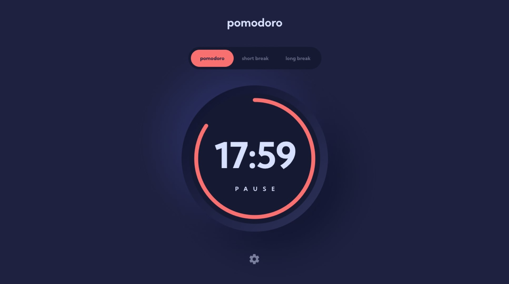

# Actimate Test - Pomodoro app

## The Challenge

Your challenge is to build a simple Pomodoro timer app and get it looking as close to the provided Figma design as possible.

Your users should be able to:

- Set a pomodoro timer and short & long break timers
- Customize how long each timer runs for
- See a circular progress bar that updates every minute and represents how far through their timer they are
- Customize the appearance of the app with the ability to set preferences for colors and fonts

## Where to find everything

Your task is to build the project using the Figma design file provided in this repository.

For icons you can use whatever you like. DaisyUI, MaterialUI, etc.

The design system in the design file will give you more information about the various colors, fonts, and styles used in this project.

## Requirements

- You must use Next.js 14 and TypeScript.
- Styles such as gradients, drop shadows, and letter spacing must match the design exactly.
  - Tailwind CSS is the library we'd prefer that you use.
- The Pomodoro settings must be accessed and modified using Next.js API Routes.

